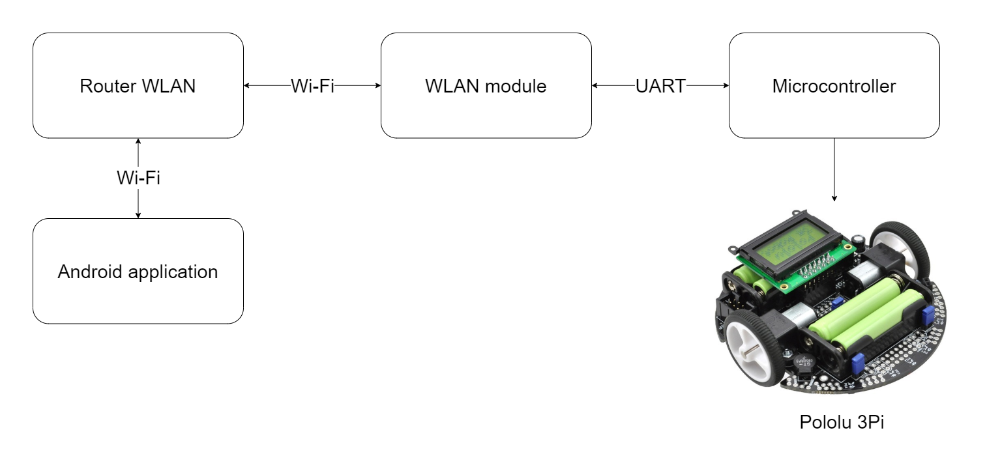
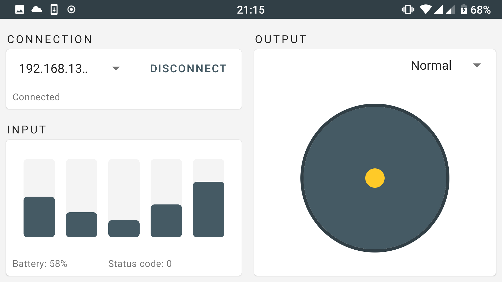
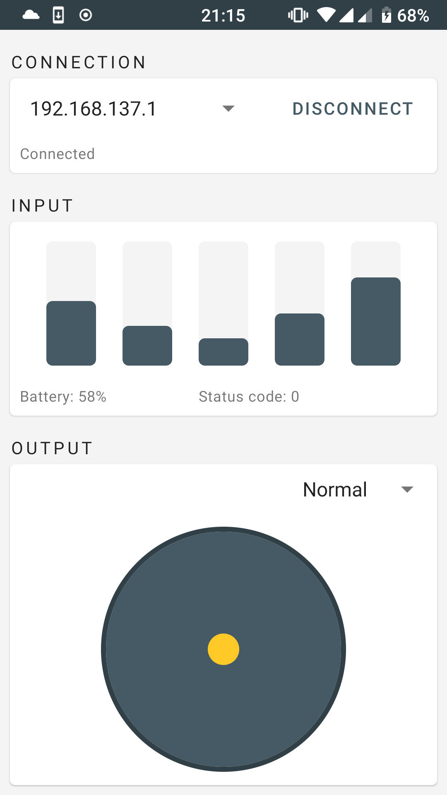

# TCP robot control			

######  Android application made for university project. Uses TCP / IP protocol to control Pololu 3Pi robot and read its sensors data.
------------

**Table of Contents**
<!-- toc -->
+ [Technology](#technology)
+ [Application-Robot communication structure](#Application-Robot%communication%structure)
+ [Screenshots](#Screenshots)
------------

### Technology
- Kotlin
- MVVM
- LiveData
- Material Design
------------

### Application-Robot communication structure

------------

### Screenshots

